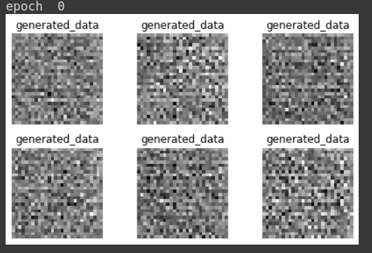
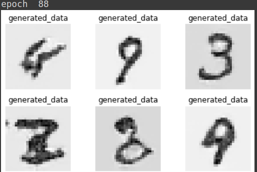

# PyTorch Gans Implementation
PyTorch implementation of [Generative Adversarial Networks
](https://arxiv.org/abs/1406.2661) by Ian Goodfellow.

Please feel free to play around with the code. The aim of this repository is to allow researchers to try different ideas in regards to GANs.

## Installation and Setup
1. Create your anaconda env
   ``` bash
   conda create -n myenv python=3.7
   ```

2. Install packages using [pip](https://pypi.org/project/pip/)
    ```bash
    pip install -r requirements.txt
    ```

## Running the Python File :snake:
``` bash
python main.py --n_batch 64 --seed 10
```
You can take a look at the flags for any other hyperparameters you would like to experiment with.

## Results
GANs are notoriously hard to train. They are extremely sensitive to hyperparameters, especially the learning rate. However, you can try tinkering around with the learning rate to achieve better results.

### Generated data at epoch 0
random noise :x:



### After 88 epochs :clock1130:



## Contributing
Please feel free to contribute. Pull requests are welcome. My goal is to manage a repositor that is comprehensive in nature, and easy to understand for beginners. 


## License
[MIT](https://choosealicense.com/licenses/mit/)
